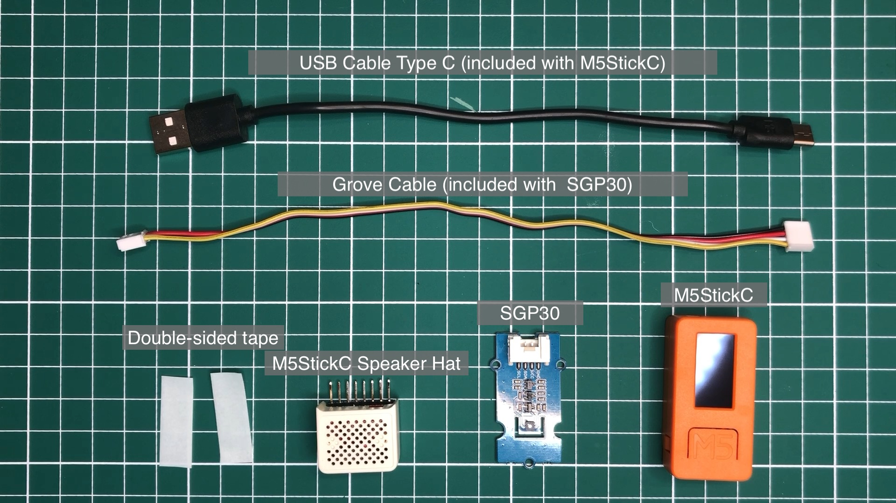
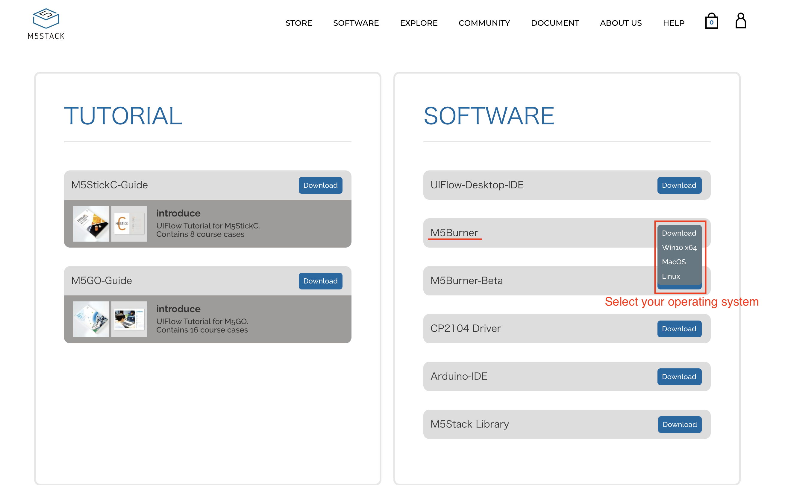
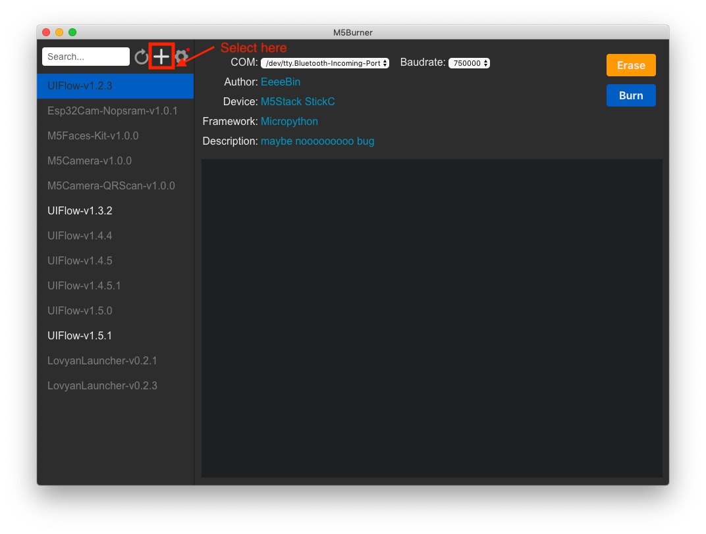
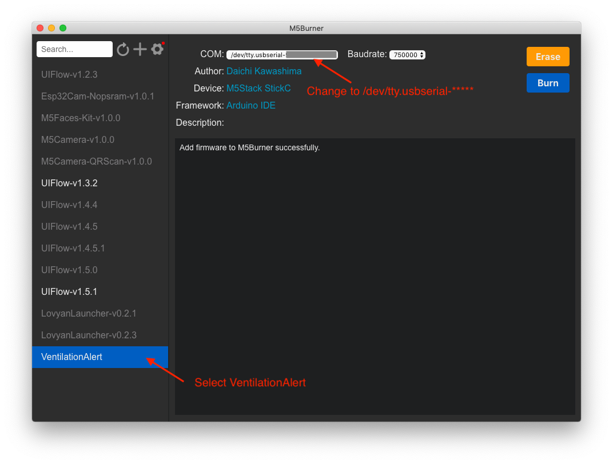
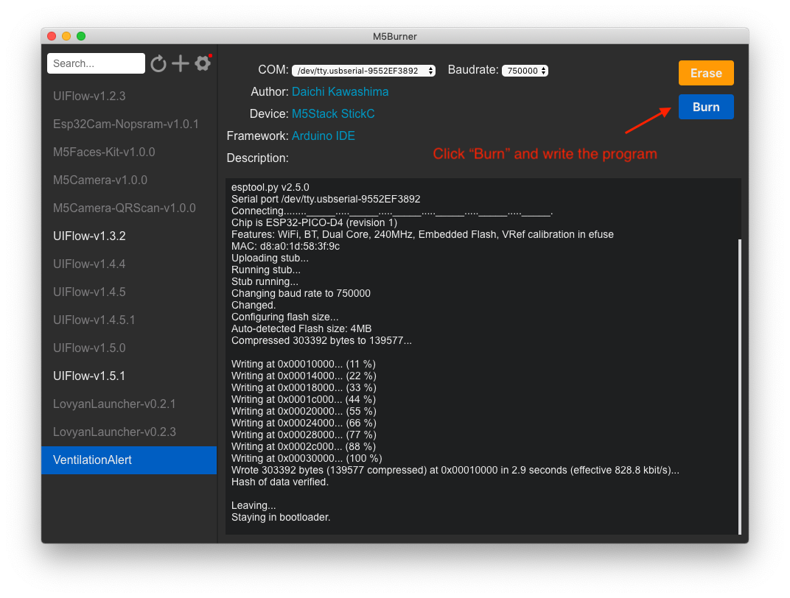
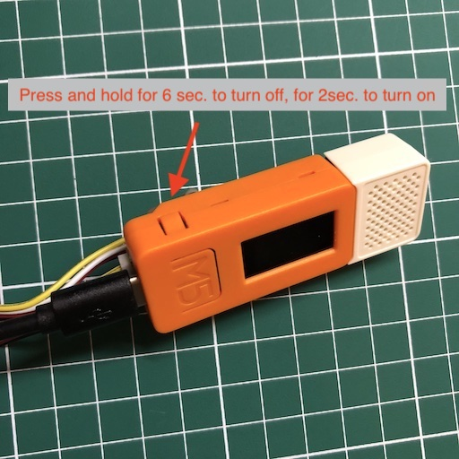

Language : [jp](./README.md) | en
# [Ventilation Alert] M5StickC_SGP30
How to make a CO2 ventilation alert device using M5StickC and SGP30
  
<strong>
Caution: The device does not measure accurate CO2 concentration since the SGP30 sensor used for the device is a gas sensor for measuring the VOC value that indicates air quality, and the equivalent carbon dioxide concentration (eCO2) is calculated based on this value. The value may be affected by temperature and humidity, and senses also alcohol and other factors, and the device is for reference purposes only. A recipe for a device with a more accurate CO2 sensor will be coming in the future.
</strong> 

# How to make it

## [Tutorial Video is also available](https://panasonic.net/design/flf/assets/img/works/dio/ventilation_alert_en.mp4)

## 1. Preparetion

### Prepare the required parts.



|     | Product name                | Photo |  Retailer link（example）                                                   | Note |
|:----:|:---------------------|:---:|:----------------------------------------------------------------|:----|
|  1  | M5StickC              | |[Marutsu online](https://www.marutsu.co.jp/pc/i/1526331/), [SwitchScience](https://www.switch-science.com/catalog/5517/), [Digi-Key](https://www.digikey.com/product-detail/en/m5stack-technology-co-ltd/K016-C/2221-K016-C-ND/10492141) | |
|  2  | USB Cable Type C | || Included with M5StickC |
|  3  | M5StickC Speaker Hat  | |[Marutsu online](https://www.marutsu.co.jp/pc/i/1556456/), [SwitchScience](https://www.switch-science.com/catalog/5754/), [Digi-Key](https://www.digikey.com/product-detail/en/m5stack-technology-co-ltd/U055/2221-U055-ND/11200926)    ||
|  4  | GROVE - VOC AND ECO2 GAS SENSOR (SGP30) | |[Marutsu online](https://www.marutsu.co.jp/pc/i/31309791/), [Digi-Key](https://www.digikey.com/products/en?mpart=101020512)||
|  5  | GROVE Cable | ||Included with GROVE - VOC AND ECO2 GAS SENSOR (SGP30)|

#### Required materials
- Double-sided tape

## 2. Connecting electronic components

### 2.1 Connect the SGP30 to the GROVE Cable.


### 2.2 Connect the M5StickC to the GROVE Cable.


### 2.3 Place double-sided tape on the SGP30, and peel off the protective paper.


### 2.4 Affix the SGP30 on the M5StickC.


### 2.5 Connect the M5StickC to the M5StickC Speaker Hat.


### 2.6 Connect the M5StickC to the USB Cable.


### 2.7 Completed.


## 3. Program writing

### 3.1 Install and start M5Burner
Download [M5Burner](https://m5stack.com/pages/download), install, and start.  
<https://m5stack.com/pages/download>    

※ For Mac, M5Burner must be installed in the application folder.




### 3.2 Connect the M5StickC to PC
※ For Windows, driver installation may be necessary.
If the M5StickC is not recognized, download the driver from the following link:  
<https://m5stack.oss-cn-shenzhen.aliyuncs.com/resource/drivers/CP210x_VCP_Windows.zip>  
※ For Mac, driver installation is unnecessary.   


### 3.3 Download binary file
Download the binary file, [VentilationAlert.zip](https://github.com/panasonic-corporation/do-it-ourselves/releases/download/v1.0.0/VentilationAlert.zip), and save it to an appropriate folder without unzipping it.  

### 3.4 Load the binary file
Load the downloaded VentilationAlert.zip with M5Burner.  
Press the “+” button on the top right to open a window.
  

Select VentilationAlert.zip in the pop-up window, and load it to M5Burner.


### 3.5 Write settings
If it is loaded successfully, the VentilationAlert item will be added to the list on the left. Select it.  
Then, change the setting of “COM” at the top to “COM-*” for Windows and “/dev/usbserial-******” for Mac.



### 3.6 Write
Click “Burn” at the top right to write the program.  
(Noise from speakers during the writing process is normal.)  

When “Staying in bootloader.” or “Hard resetting vir RTS pin...” appears in the lower right window, writing is completed.  

※ If you accidentally selected “Erase,” burn UIFlow or LovyanLauncher, and then burn VentilationAlert.



### 3.7 Rebooting M5StickC
Reboot M5StickC when the writing is completed.


(This step is unnecessary if it reboots automatically after the writing is completed.)


Press and hold the push switch on the side of the M5 mark for 6 seconds to turn off the power.  
After waiting a few seconds, press and hold the same push switch for 2 seconds to turn on the power.  


### 3.8 Operation Check
When power is turned on, the M5StickC displays a measured CO2 value.  
Blow on the sensor, and confirm that the sound and the red LED light on the M5StickC body are activated when the level exceeds 1,000 ppm.  
  


## 4. Make a cover (body)

Build your own cover with flexible ideas! <!--Share your cover on Twitter and Instagram with the hashtag #dio_product.-->


There are four sample templates that are easy to make using toilet paper cores.  

| File name | Photo | Difficulty level |
|-------|-------|-------|
| [bird.pdf](../docs/data/bird.pdf) |  | Medium |
| [flower.pdf](../docs/data/flower.pdf) |  | Easy |
| [plant.pdf](../docs/data/plant.pdf) |  | Easy |
| [spring.pdf](../docs/data/spring.pdf) |  | Easy |

As a sample, here is how to make a bird cover.  

### 4.1
Download the pdf from the table above, and print it out in actual size on A4 paper.  


### 4.2
Cut along the outer solid lines with scissors. 


### 4.3
Make creases along the dotted lines.  


### 4.4
Put glue on the back side, wrap a toilet paper core with it to attach it.  


### 4.5
Put glue on the surface of part C, and attach it to the other end to form a tube.  


### 4.6
Fold the top and bottom tabs inward and glue them to the core.  


### 4.7
Cut out parts D and E with scissors. Save the cut-out part D.  


### 4.8
Use a utility knife to make a slit along line F.  


### 4.9
Insert both ends of D into F to make a beak to finish the cover. Place the device inside.  

<br>


# How to use

1. Power on

    Connect the USB Type C cable to the USB power connector. The program starts up automatically.  

    

2. Select alert sound

    Press the “M5” push switch on M5StickC to change the alert sound.  

    | Displayed name | Sound |
    |-------|-------|
    |Twitter| Bird chirping |
    |Electric| Electric sound |
    |Charmela| Suona tune |

3. Install

    In order to measure the indoor CO2 concentration correctly, place the device in an area that is not directly exposed to human breath. M5StickC is equipped with a small built-in battery, which lasts for up to several dozen minutes without a power supply, when fully-charged. However, to ensure continuous operation, the USB should be directly plugged in to a wall outlet to obtain a continuous power supply.

    

4. Use

    When an alert is activated, ventilate the area by opening windows or turning on exhaust fans.

    The alert does not continue to sound. After the CO2 concentration exceeds 1,000 ppm, the audible alert will be reactivated only after the concentration first falls below 700 ppm. (The LED light stays on until it falls below 700 ppm.)

# 【For Creators】 Software Improvement and Modification
The D+IO Project allows users to modify and upgrade the recipes. Use your creativity to update the D+IO PRODUCTS. We look forward to your suggestions for fixing code and making improvements posted on PullRequest and Issue.

### Packaging Method
How to generate a zip file to burn from M5Burner

#### 1. Create a binary file
Output a binary file from ArduinoIDE.  


#### 2. Move the file
Put the generated binary file under “build/firmware,” and change the file name to “firmware_0x10000.bin.“  

#### 3. Compress the file
Compress the “firmware” folder under “build” and “m5burner.json” together into a zip file, and name the file “VentilationAlert.zip.”  

```
# sample command
$ zip -r VentilationAlert.zip firmware m5burner.json
```

### About Audio Data
Convert audio data to wav unsigned 8-bit data, and add a hexadecimal array as a variable. Below are sample commands of a conversion command using ffmpeg, and a command to output a hexadecimal array using xxd.

#### Unsigned 8-bit conversion（ffmpeg）
```
# sample command
$ ffmpeg -i input.wav -vn -ac 1 -ar 16000 -acodec pcm_u8 -f wav output.wav
```

#### Output a hexadecimal array（xxd）
```
# sample command
$ xxd -i output.wav > sample_data
```

# FAQ

## M5Burner does not start up

- When a warning such as the following appears on a Mac, try [“Open a Mac app from an unidentified developer.”](https://support.apple.com/ja-jp/guide/mac-help/mh40616/mac)  


## M5Burner does not read VentilationAlert.zip

- Load VentilationAlert.zip without unzipping.

- For Mac, ensure the M5Burner is installed in the application folder.

